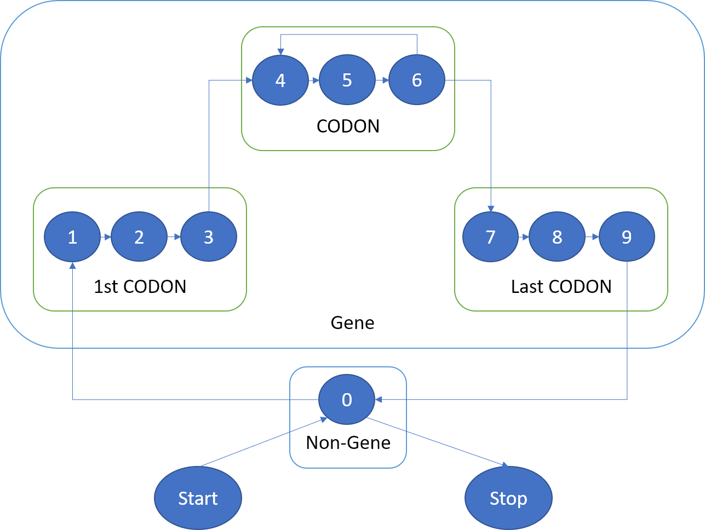

# HMM

- Implemente os Algoritmos de Viterbi e de Forward para HMMs.
- Tente aplicar estes algoritmos num um genoma bacteriano, eg. E-Coli
- Treine os algoritmos (não precisa de forward).
- Compare usando para treino a própria bactéria, uma bactéria semelhante e outra mais distante.



### To run:

```console
python hmm.py
```


##### Python 3.x needed
